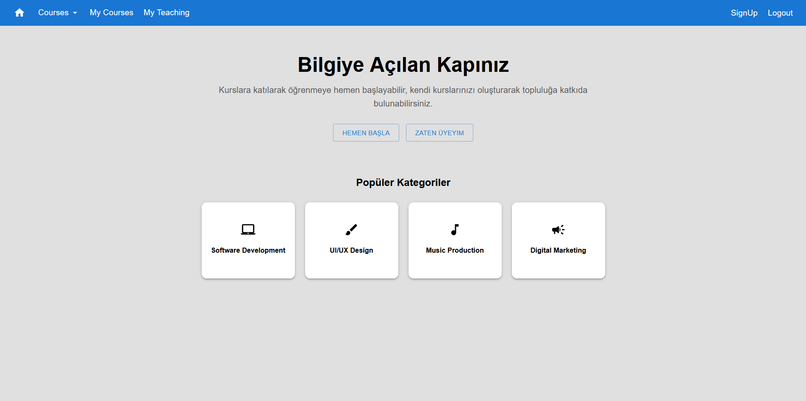
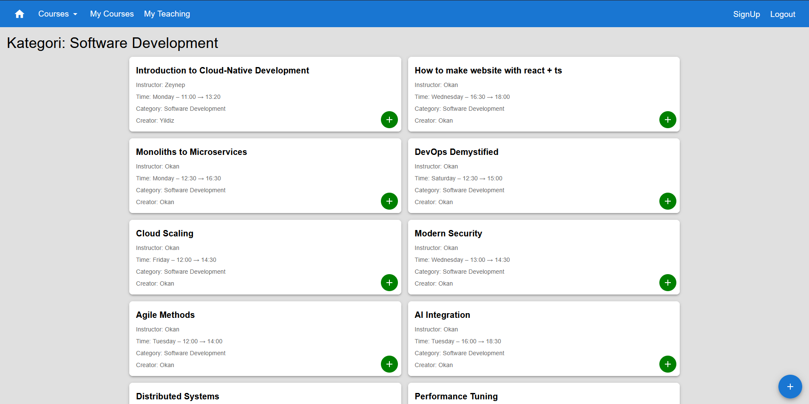
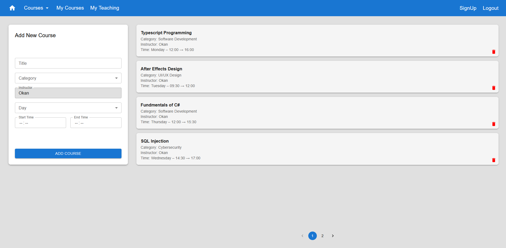

# 📚 Course Stream Prototype — Course Platform • (Archived)

## 📌 Project Overview
A simple **course simulation prototype** built with **React** and **Material UI**.  
Users can **sign up**, **log in**, **browse courses**, and **simulate enrolling or teaching**, similar to a lightweight Udemy/YouTube hybrid.  
The app includes **basic business logic** to prevent scheduling conflicts between courses. 
> 📦 **Archived** — This project is no longer being updated. It’s kept as part of my learning history and serves as a technical reference for future projects.

 

## 🖼️ Screenshots
Shown below in order:  
**1. Landing** · **2. Explore Courses** · **3. My Teaching**

  
  
  

 

## 🧰 Tech Stack

  
  
  
  
  

 

## 📜 License

This project is licensed under the terms described in the [LICENSE](./LICENSE) file.

---

© 2025 Yusuf Okan Sirkeci — [Hereetria](https://github.com/Hereetria)
